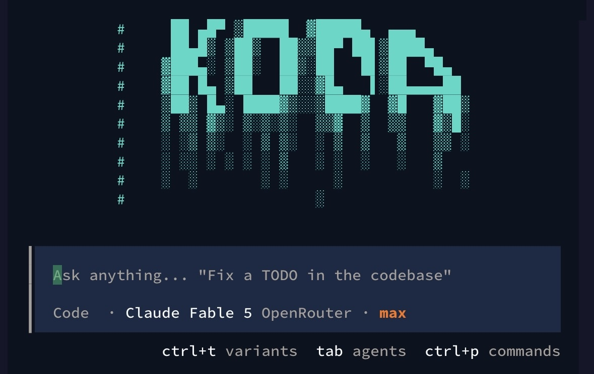

# Koda

> **A terminal-native AI engineering agent for deliberate planning, safe execution, and evidence-based delivery.**



Koda brings an AI coding workflow into the terminal. Start it in a repository, describe the outcome you need, review proposed actions, and keep the work grounded in the files, commands, tests, and permissions that define the project. The product ships as a command-line interface with a keyboard-first terminal UI.

## Why Koda

| Engineering need | Koda approach |
|---|---|
| Keep work close to the codebase | Run from the project directory and operate through the terminal. |
| Make long tasks controllable | Use bounded task, retry, concurrency, cost, and compaction policies. |
| Preserve human authority | Require explicit permission decisions for consequential file and shell actions. |
| Recover useful project context | Store durable sessions and project-scoped lessons without treating them as ground truth. |
| Finish with evidence | Inspect the change and run focused validation before reporting completion. |

The terminal is the complete product boundary. Koda retains its CLI, interactive TUI, core agent runtime, provider system, session services, local indexing, memory, sandbox boundaries, lifecycle hooks, and MCP support.

## Install

Install the public CLI globally with one package manager.

```bash
# npm
npm install --global @koda-code/cli

# pnpm
pnpm add --global @koda-code/cli

# Bun
bun add --global @koda-code/cli
```

Move to a repository and launch the interactive terminal workspace.

```bash
cd path/to/your-project
koda
```

For an ephemeral run, use your package manager's runner instead of installing globally.

```bash
npx --yes --package @koda-code/cli koda
pnpm dlx --package @koda-code/cli koda
bunx --package @koda-code/cli koda
```

The repository also provides an installer for source-oriented setups.

```bash
curl -fsSL https://raw.githubusercontent.com/pooraddyy/koda/main/install.sh | bash
source ~/.bashrc
koda
```

## A practical terminal workflow

Open Koda from the project that owns the change. Give it a result-oriented request, include relevant constraints, and let permission prompts define the approval boundary.

```text
Reproduce the failing API test, identify the smallest safe fix,
update the relevant test if behavior is intentionally changing,
and run the narrowest verification command before summarizing.
```

Koda keeps routine reads and searches quiet so the TUI stays focused. Reasoning progress, permission requests, failed actions, and the final evidence remain visible. Use the slash-command prompt for provider setup, sessions, collaboration, hooks, and other interactive controls.

| Command | Use it for |
|---|---|
| `koda [project]` | Open the interactive TUI for the current or supplied project. |
| `koda run "<task>"` | Begin a task directly from a shell command. |
| `koda models [provider]` | List available models, optionally for one provider. |
| `koda auth` | Configure or inspect authentication. |
| `koda agent` | Inspect configured agent definitions. |
| `koda session` | List, resume, export, or import durable sessions. |
| `koda collaboration` | Inspect, recover, or cancel bounded collaboration graphs. |
| `koda evolution status --json` | Inspect retained, project-scoped lessons. |
| `koda hooks list` | Review registered lifecycle hooks. |
| `koda help [command]` | Read the installed command reference. |

> Command availability follows the installed version and configuration. Run `koda help` whenever your local command surface differs from this overview.

## Providers and configuration

Use `/connect` in the TUI to authenticate a supported provider or add a custom OpenAI-compatible endpoint. The guided flow accepts a provider name and identifier, model identifier and display name, base API URL, and optional API key. Provider and model definitions are persisted in Koda's global configuration, so a restart does not require entering the same custom endpoint again.

```text
/connect
→ Other provider
→ Provider name and ID
→ Model ID and display name
→ Base API URL
→ Optional API key
```

Keep credentials out of Git, shell history, URLs, and shared configuration files. The repository contains a detailed configuration reference at [`packages/opencode/src/koda/skills/koda-config.md`](packages/opencode/src/koda/skills/koda-config.md), including project/global precedence, permissions, MCP servers, custom skills, and TUI settings.

## Bounded collaboration and durable context

Koda can split larger work into focused, parallel, review, or thorough collaboration modes. Each graph has explicit limits and lifecycle records so that it can be inspected, cancelled, or recovered rather than becoming an uncontrolled background loop. Use `/collaboration` to configure coordinated work and `/long-run <goal>` when a goal needs checkpoints and acceptance criteria.

Project lessons are small, redacted, deduplicated observations that can improve future context. They are never a substitute for current instructions, repository state, permission rules, tool output, or fresh test results.

## Repository architecture

| Area | Responsibility |
|---|---|
| `packages/opencode` | Koda CLI, command surface, sessions, providers, and local agent services. |
| `packages/tui` | Keyboard-first terminal UI, dialogs, display logic, and terminal notifications. |
| `packages/core` | Shared configuration primitives and runtime utilities. |
| `packages/llm` | Language-model abstractions and provider integrations. |
| `packages/koda-memory` | Project-scoped lesson storage, indexing, and recall. |
| `packages/koda-indexing` | Local codebase indexing support. |
| `packages/koda-gateway` | Authentication, provider, and API integration services. |
| `packages/koda-sandbox` | Sandboxed execution policy and launch preparation. |
| `packages/koda-telemetry` | Telemetry integration and controls. |

## Develop from source

```bash
git clone https://github.com/pooraddyy/koda.git
cd koda
bun install --frozen-lockfile
bun run dev
```

Use targeted package checks while developing. The root `test` command is intentionally guarded to prevent an accidental broad test run.

```bash
# Confirm the CLI command surface
bun run --cwd packages/opencode --conditions=node src/index.ts --help

# Run terminal UI checks
bun test --cwd packages/tui
bun run --cwd packages/tui typecheck

# Run core Koda memory checks
bun test --cwd packages/koda-memory

# Run Koda-focused CLI tests
bun test --cwd packages/opencode test/koda
```

For HTTP server testing and API-oriented debugging, use the terminal-only procedures in [`TESTING.md`](TESTING.md).

## Safety model

Koda is a powerful local developer tool, not a security sandbox. Read permissions before approving edits or shell commands. Treat repository instructions, hooks, MCP servers, external URLs, copied commands, and provider output as untrusted until you have reviewed the scope and provenance.

Koda is designed to keep approval, cancellation, verification, and bounded execution in the workflow. Do not enable automatic approval unless the workspace, dependencies, credentials, and allowed command scope are all trusted.

See [`SECURITY.md`](SECURITY.md) for the security boundary and responsible disclosure guidance.

## License and project links

Koda is distributed under the [MIT License](LICENSE). Source, releases, and issue tracking are available through the [Koda repository](https://github.com/pooraddyy/koda), and the CLI package is published as [`@koda-code/cli`](https://www.npmjs.com/package/@koda-code/cli).
